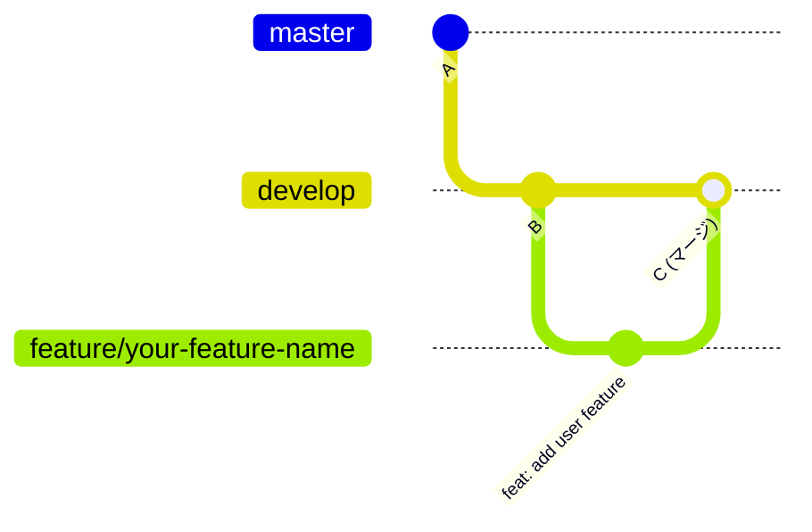
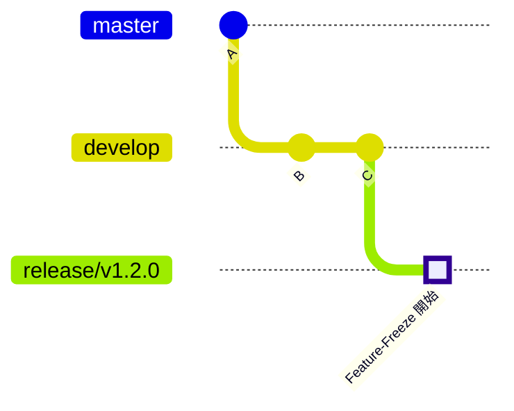
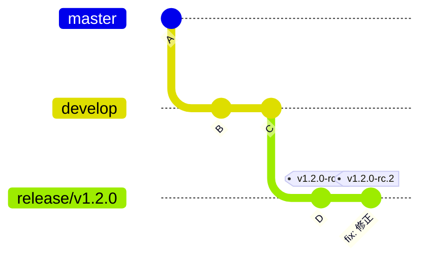
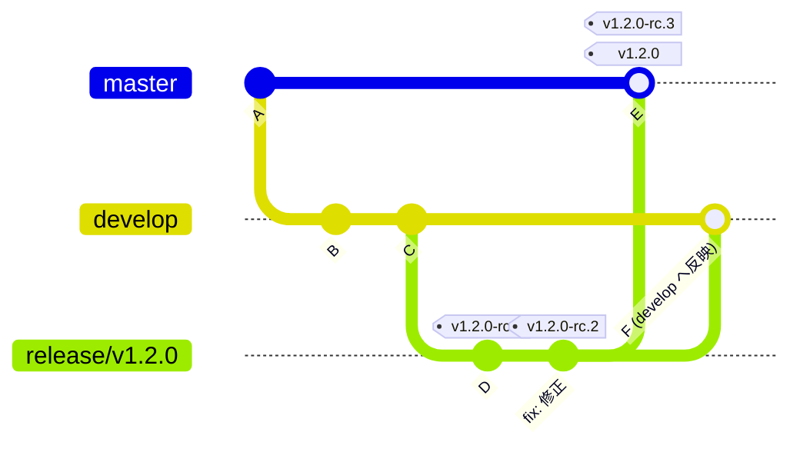
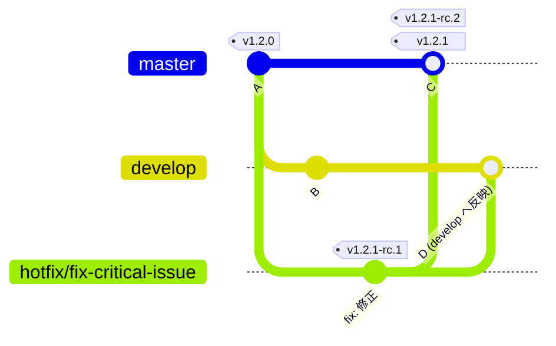
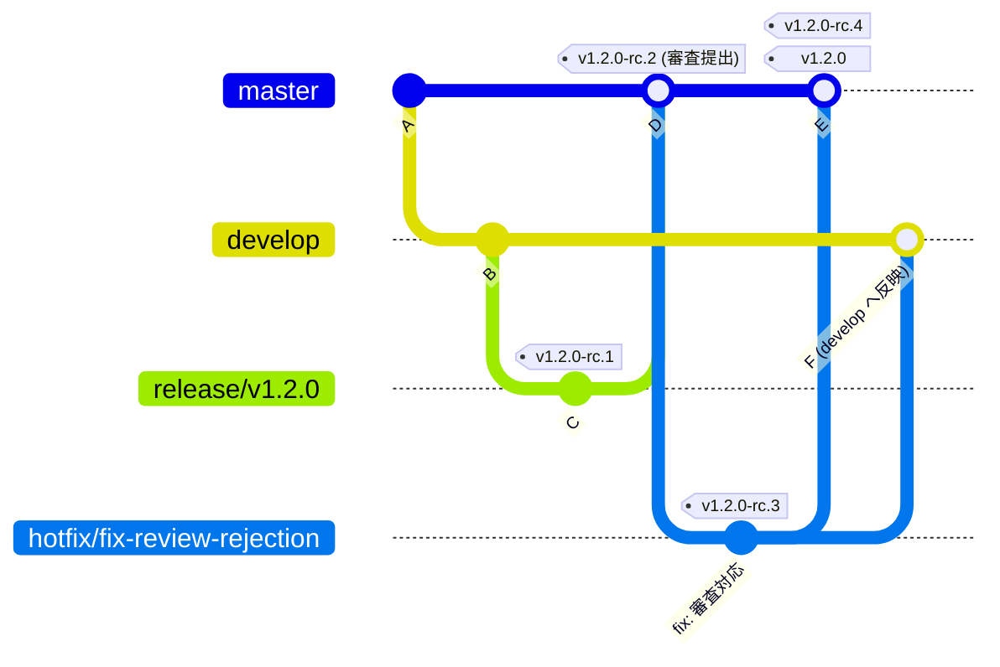
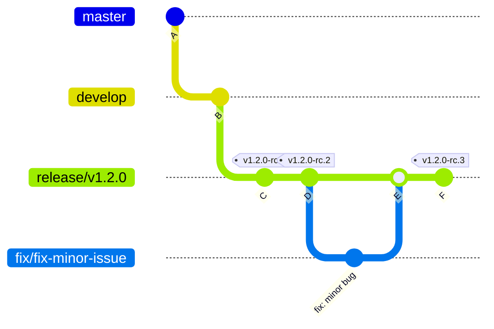
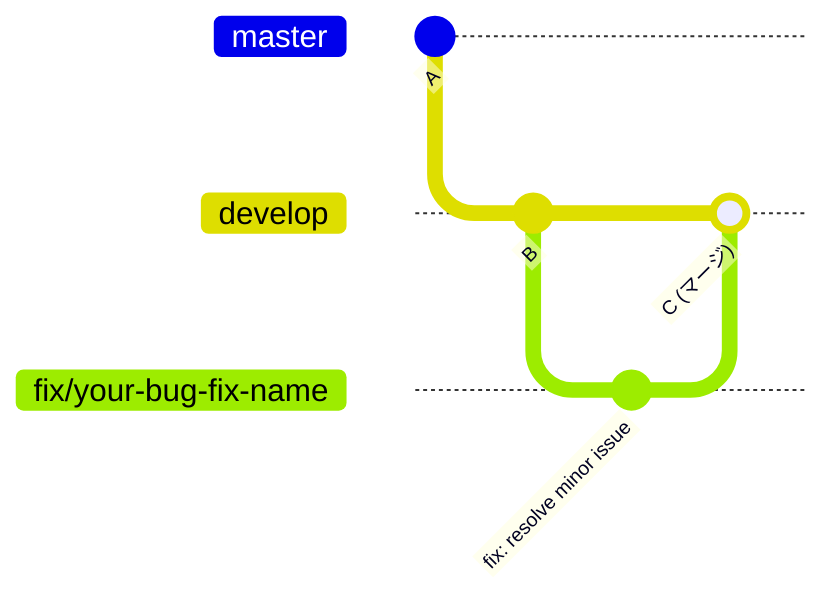
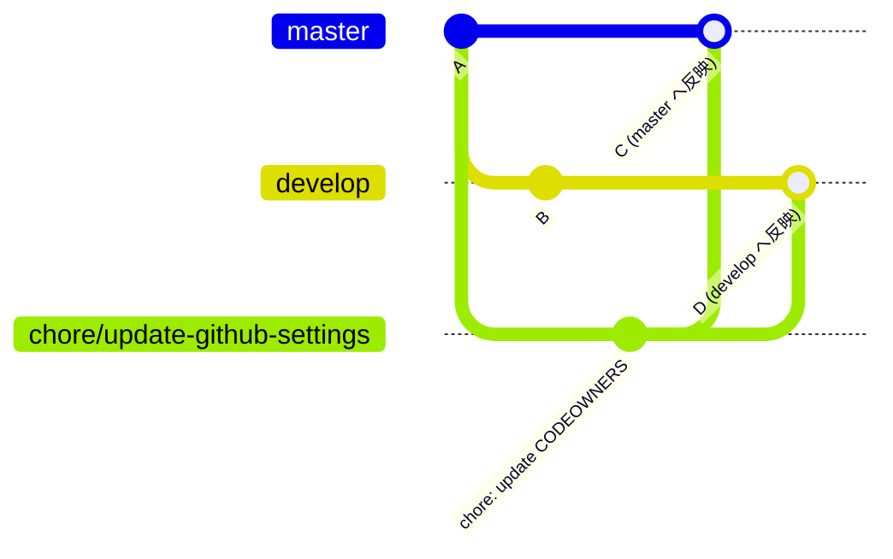
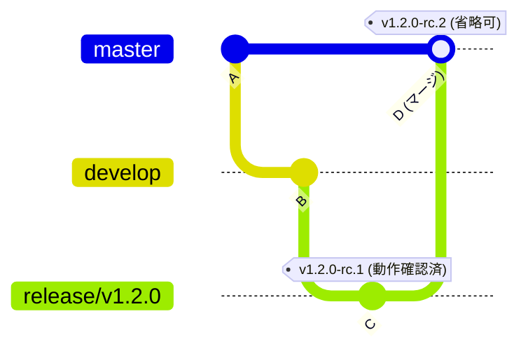

# ブランチ・デプロイ運用手順書

本ドキュメントは、ブランチおよびデプロイに関する代表的な運用シナリオにおける step-by-step 手順を記載したものです。

## 目次

1. [新機能を開発する](#新機能を開発する)
2. [リリースブランチを作成する](#リリースブランチを作成する)
3. [RC タグを作成して STG にデプロイする](#rc-タグを作成して-stg-にデプロイする)
4. [本番リリースを実施する](#本番リリースを実施する)
5. [Hot-fix を適用する](#hot-fix-を適用する)
6. [審査リジェクト対応](#審査リジェクト対応)
7. [リリース後のバグ修正（非 Hot-fix）](#リリース後のバグ修正非-hot-fix)
8. [develop ブランチでのバグ修正](#develop-ブランチでのバグ修正)
9. [GitHub 設定変更を適用する](#github-設定変更を適用する)
10. [デプロイ・配布と動作確認を省略する](#デプロイ配布と動作確認を省略する)

---

## 新機能を開発する

> **関連ドキュメント**: [ブランチ戦略 - 機能開発フロー](./branching-strategy.md#機能開発フロー)

### 前提条件

- `develop` ブランチが最新であること
- 作業する機能が明確であること

### 手順

#### Step 1: feature ブランチを作成

```bash
git fetch origin develop
git checkout -B feature/your-feature-name origin/develop
```

#### Step 2: 機能を実装

```bash
# 変更を実施
# ...

git add .
git commit -m "feat: add user feature"
```

> **注意**: `feat:` プレフィックスを持つコミットは `feature` ブランチで行い、`develop` にマージしてください。

#### Step 3: リモートへプッシュ

```bash
git push origin feature/your-feature-name
```

#### Step 4: PR を作成

1. GitHub で `develop` ブランチに対する PR を作成
2. レビュアーを設定
3. レビュー承認後、マージ

### コミットグラフ



---

## リリースブランチを作成する

> **関連ドキュメント**: [ブランチ戦略 - リリースブランチの運用](./branching-strategy.md#リリースブランチの運用)

### 前提条件

- 次のリリースに含める機能が `develop` ブランチに揃っていること
- リリースするバージョン番号が決定していること

### 手順

#### Step 1: develop ブランチを最新化

```bash
git fetch origin develop
```

#### Step 2: リリースブランチを作成

```bash
# 例: v1.2.0 のリリースを準備する場合
git checkout -B release/v1.2.0 origin/develop
```

#### Step 3: リモートへプッシュ

```bash
git push origin release/v1.2.0
```

#### Step 4: Feature-Freeze を宣言

- チームに Feature-Freeze 状態であることを通知
- 以降、`release/v1.2.0` ブランチには新機能の追加は禁止

### コミットグラフ



---

## RC タグを作成して STG にデプロイする

> **関連ドキュメント**: [デプロイ戦略 - RC タグの作成場所](./deployment-strategy.md#rc-タグの作成場所)

RC タグはリリースプロセスにおいて複数回作成されます。ここでは release ブランチ上での RC タグ作成手順を説明します。

### 前提条件

- リリースブランチが存在すること
- リリース対象のコードがプッシュ済みであること

### 手順

#### Step 1: release ブランチをチェックアウト

```bash
git fetch origin release/v1.2.0
git checkout -B release/v1.2.0 origin/release/v1.2.0
```

#### Step 2: RC タグを作成

```bash
# 最初の RC の場合
git tag v1.2.0-rc.1

# 2回目以降の RC の場合（release ブランチが更新されるたびに作成）
git tag v1.2.0-rc.2
```

#### Step 3: RC タグをプッシュ

```bash
git push origin v1.2.0-rc.1
```

#### Step 4: STG 環境へデプロイ

**Web アプリの場合:**

```bash
# CI/CD パイプラインが自動デプロイ
# または手動でデプロイスクリプトを実行
./deploy.sh stg v1.2.0-rc.1
```

**モバイルアプリの場合:**

```bash
# iOS: TestFlight への配布
bundle exec fastlane beta

# Android: 内部テストトラックへの配布
bundle exec fastlane deploy_internal
```

#### Step 5: 動作確認

- [ ] 新機能が正しく動作すること
- [ ] 既存機能にデグレードがないこと
- [ ] パフォーマンスに問題がないこと
- [ ] エラーログに異常がないこと

> **注意**: 動作確認で問題が見つかった場合は、release ブランチで修正を行い、新しい RC タグを作成して再度 STG にデプロイします。

### コミットグラフ

以下は、release ブランチ上で RC タグを作成し、修正後に新しい RC タグを作成するフローの例です。



---

## 本番リリースを実施する

> **関連ドキュメント**: [デプロイ戦略 - ブランチ・タグと環境の対応](./deployment-strategy.md#ブランチタグと環境の対応)

### 前提条件

- release ブランチでの RC タグによる動作確認が完了していること
- release ブランチの準備が完了していること

### 手順

#### Step 1: release ブランチから master への PR を作成

1. GitHub で `master` ブランチに対する PR を作成（ソースブランチ: `release/v1.2.0`）
2. レビュアーを設定
3. レビュー承認後、マージ

#### Step 2: master ブランチをチェックアウト

```bash
git fetch origin master
git checkout -B master origin/master
```

#### Step 3: master 上で RC タグを作成して STG で最終確認

```bash
git tag v1.2.0-rc.3  # release ブランチでの最後の RC からインクリメント
git push origin v1.2.0-rc.3
```

**モバイルアプリの場合（審査提出）:**

```bash
# iOS: TestFlight への配布・審査提出
bundle exec fastlane beta

# Android: 内部テストトラックへの配布・審査提出
bundle exec fastlane deploy_internal
```

#### Step 4: STG 環境で最終確認（モバイルアプリは審査パスを待つ）

- [ ] 新機能が正しく動作すること
- [ ] 既存機能にデグレードがないこと
- [ ] モバイルアプリの場合、審査にパスしていること

> **動作確認 NG の場合**: master から `hotfix/*` ブランチを分岐し、修正を行います。修正完了後に `hotfix/*` 上で RC タグを作成して動作確認し、問題がなければ master にマージして新しい RC タグを作成します。

#### Step 5: 本番リリースタグを作成

> **重要**: 審査にパスした RC タグと同じコミットに対して正式タグを作成します。正式タグのビルドは審査に再提出しません。

```bash
git tag v1.2.0
git push origin v1.2.0
```

#### Step 6: PRD 環境へデプロイ

**Web アプリの場合:**

```bash
# 手動デプロイまたは承認後の半自動デプロイ
./deploy.sh prd v1.2.0
```

**モバイルアプリの場合:**

> **注意**: モバイルアプリでは、審査にパスした RC タグのビルドがそのままストアリリースされます。正式タグ `vX.Y.Z` から新たにビルドを作成して審査に再提出することはありません。

```bash
# ストアへのリリース（審査パス済みのビルドをリリース）
bundle exec fastlane release
```

#### Step 7: develop ブランチへの反映

release ブランチを develop にマージするための PR を作成します。

1. GitHub で `develop` ブランチに対する PR を作成（ソースブランチ: `release/v1.2.0`）
2. レビュアーを設定
3. レビュー承認後、マージ

> **注意**: develop に master をマージするのではなく、release ブランチを develop にマージします。

#### Step 8: リリースブランチの削除（オプション）

```bash
git branch -d release/v1.2.0
git push origin --delete release/v1.2.0
```

### コミットグラフ

以下は、release ブランチで複数回の修正と RC タグ作成を経て、master へマージし本番リリースする完全なフローの例です。



> **注**: 
> - 上記の例では、release ブランチ上で RC タグ（rc.1、rc.2）が作成され、その後 master へマージされています。マージコミット E には RC タグ `v1.2.0-rc.3` と正式タグ `v1.2.0` の両方が付与されます（同一コミット）。

---

## Hot-fix を適用する

> **関連ドキュメント**: [ブランチ戦略 - Hot-fix の運用](./branching-strategy.md#hot-fix-の運用)

### 前提条件

- 本番環境で緊急の問題が発生していること
- 修正内容が明確であること

### 手順

#### Step 1: hotfix ブランチを作成

```bash
git fetch origin master
git checkout -B hotfix/fix-critical-issue origin/master
```

#### Step 2: 修正を実施

```bash
git add .
git commit -m "fix: fix critical issue"
git push origin hotfix/fix-critical-issue
```

#### Step 3: hotfix ブランチ上で RC タグを作成して STG で確認

```bash
git tag v1.2.1-rc.1
git push origin v1.2.1-rc.1
```

#### Step 4: STG 環境で動作確認

- [ ] 修正が正しく適用されていること
- [ ] 他の機能に影響がないこと

> **動作確認 NG の場合**: hotfix ブランチで追加の修正を行い、新しい RC タグを作成して再度確認します。

#### Step 5: master への PR を作成してマージ

1. GitHub で `master` ブランチに対する PR を作成
2. レビュー承認後、マージ

#### Step 6: master 上で RC タグを作成して最終確認

```bash
git fetch origin master
git checkout -B master origin/master
git tag v1.2.1-rc.2  # hotfix での最後の RC からインクリメント
git push origin v1.2.1-rc.2
```

#### Step 7: 本番リリースタグを作成

```bash
git tag v1.2.1
git push origin v1.2.1
```

#### Step 8: PRD 環境へデプロイ

```bash
./deploy.sh prd v1.2.1
```

#### Step 9: develop へ反映

hotfix ブランチを develop にマージするための PR を作成します。

1. GitHub で `develop` ブランチに対する PR を作成（ソースブランチ: `hotfix/fix-critical-issue`）
2. レビュアーを設定
3. レビュー承認後、マージ

> **注意**: develop に master をマージするのではなく、hotfix ブランチを develop にマージします。

### コミットグラフ



---

## 審査リジェクト対応

> **関連ドキュメント**: [デプロイ戦略 - 審査対応](./deployment-strategy.md#審査対応)

### 前提条件

- 審査リジェクトの通知を受けていること
- リジェクト理由が確認済みであること

### 手順

#### Step 1: リジェクト理由を確認

ストアからの通知を確認し、修正が必要な箇所を特定します。

#### Step 2: master ブランチ上で Hot-fix 相当の修正を実施

```bash
git fetch origin master
git checkout -B hotfix/fix-review-rejection origin/master
```

修正を実施します：

```bash
git add .
git commit -m "fix: address app store review rejection"
git push origin hotfix/fix-review-rejection
```

#### Step 3: hotfix ブランチ上で RC タグを作成して動作確認

```bash
git tag v1.2.0-rc.3
git push origin v1.2.0-rc.3
```

STG 環境にデプロイ・配布して動作確認を行います。

- [ ] 修正が正しく適用されていること
- [ ] 他の機能に影響がないこと

> **動作確認 NG の場合**: hotfix ブランチで追加の修正を行い、新しい RC タグを作成して再度確認します。

#### Step 4: master への PR を作成してマージ

1. GitHub で `master` ブランチに対する PR を作成
2. レビュー承認後、マージ

#### Step 5: master 上で新しい RC タグを作成

> **重要**: 審査に提出するのは常に `master` ブランチ上の RC タグ (`vX.Y.Z-rc.N`) からビルドしたアプリです。

```bash
git fetch origin master
git checkout -B master origin/master
git tag v1.2.0-rc.4
git push origin v1.2.0-rc.4
```

#### Step 6: STG 環境で動作確認（省略可能）

> **注意**: hotfix ブランチ上の RC タグ（`v1.2.0-rc.3`）と master 上の RC タグ（`v1.2.0-rc.4`）のソースコードに差分がない場合、STG でのデプロイ・配布と動作確認は省略できます。詳細は「[デプロイ・配布と動作確認を省略する](#デプロイ配布と動作確認を省略する)」を参照してください。

```bash
bundle exec fastlane beta  # iOS の場合
```

#### Step 7: 審査再提出

> **注意**: 再提出するのは新しい RC タグ (`v1.2.0-rc.4`) のビルドです。

```bash
bundle exec fastlane release_to_review
```

#### Step 8: 審査パス後、本番リリースへ

審査にパスした RC タグと同じコミットに対して正式タグ `vX.Y.Z` を作成します。

```bash
git tag v1.2.0
git push origin v1.2.0
```

#### Step 9: develop へ反映

hotfix ブランチを develop にマージするための PR を作成します。

1. GitHub で `develop` ブランチに対する PR を作成（ソースブランチ: `hotfix/fix-review-rejection`）
2. レビュアーを設定
3. レビュー承認後、マージ

> **注意**: develop に master をマージするのではなく、hotfix ブランチを develop にマージします。

### コミットグラフ



> **注**: 
> - 審査リジェクト対応では、`hotfix/*` ブランチで修正を行い、RC タグ（`v1.2.0-rc.3`）を作成して STG で動作確認を行います。その後 master にマージし、新しい RC タグ（`v1.2.0-rc.4`）を作成します。
> - 多くの場合、hotfix ブランチ上の RC タグと master マージ後の RC タグはソースコードに差分がないため、二度目の STG デプロイ・配布は省略できます。詳細は「[デプロイ・配布と動作確認を省略する](#デプロイ配布と動作確認を省略する)」を参照してください。

---

## リリース後のバグ修正（非 Hot-fix）

> **関連ドキュメント**: [ブランチ戦略 - 非 Hot-fix 修正の運用](./branching-strategy.md#非-hot-fix-修正の運用)

### 前提条件

- 緊急性のないバグが発見されていること
- 現在の release ブランチに関係する修正であること

### 手順

#### Step 1: 現在のリリースブランチから fix ブランチを作成

```bash
git fetch origin release/v1.2.0
git checkout -B fix/fix-minor-issue origin/release/v1.2.0
```

#### Step 2: 修正を実施

```bash
git add .
git commit -m "fix: fix minor bug"
```

#### Step 3: リモートへプッシュ

```bash
git push origin fix/fix-minor-issue
```

#### Step 4: release ブランチに対する PR を作成

1. GitHub で `release/v1.2.0` ブランチに対する PR を作成
2. レビュー承認後、マージ

#### Step 5: 新しい RC タグを作成

```bash
git fetch origin release/v1.2.0
git checkout -B release/v1.2.0 origin/release/v1.2.0
git tag v1.2.0-rc.3  # 前回の RC からインクリメント
git push origin v1.2.0-rc.3
```

#### Step 6: STG で動作確認後、本番リリースへ

「本番リリースを実施する」の手順に従ってリリースを完了します。

### コミットグラフ



---

## develop ブランチでのバグ修正

> **関連ドキュメント**: [ブランチ戦略 - 非 Hot-fix 修正の運用](./branching-strategy.md#非-hot-fix-修正の運用)

現在の release ブランチに関係しない、緊急性のないバグ修正や改善を行う場合の手順です。Feature-Freeze 期間中であっても、この手順で対応します。

### 前提条件

- 修正が現在の release ブランチに関係しないこと
- 緊急性のないバグや改善であること

### 手順

#### Step 1: fix または chore ブランチを作成

```bash
git fetch origin develop
git checkout -B fix/your-bug-fix-name origin/develop
# または
git checkout -B chore/your-chore-name origin/develop
```

#### Step 2: 修正を実施

```bash
# 変更を実施
# ...

git add .
git commit -m "fix: resolve minor issue"
# または
git commit -m "chore: update documentation"
```

#### Step 3: リモートへプッシュ

```bash
git push origin fix/your-bug-fix-name
```

#### Step 4: PR を作成

1. GitHub で `develop` ブランチに対する PR を作成
2. レビュアーを設定
3. レビュー承認後、マージ

> **注意**: この修正は次回のリリースに含まれます。

### コミットグラフ



---

## GitHub 設定変更を適用する

> **関連ドキュメント**: [ブランチ戦略 - GitHub 設定変更などの特殊な master PR 運用](./branching-strategy.md#github-設定変更などの特殊な-master-pr-運用)

`.github/CODEOWNERS` や GitHub Actions ワークフローなど、GitHub の挙動を変更する設定ファイルを、バージョン更新なしで master と develop の両方に迅速に適用する手順です。

### 前提条件

- 変更がアプリケーションコードに影響しないこと
- `.github/` 以下のファイルまたはリポジトリー設定ファイルの変更であること

### 手順

#### Step 1: master ブランチから chore ブランチを作成

```bash
git fetch origin master
git checkout -B chore/update-github-settings origin/master
```

> **注意**: ブランチ名は変更内容に応じて適切に命名してください。例:
> - `chore/update-codeowners`
> - `chore/update-workflows`
> - `chore/update-issue-templates`

#### Step 2: 設定ファイルを変更

```bash
# 例: CODEOWNERS を編集
vim .github/CODEOWNERS

# 例: GitHub Actions ワークフローを編集
vim .github/workflows/ci.yml
```

#### Step 3: 変更をコミット

```bash
git add .
git commit -m "chore: update CODEOWNERS"
# または
git commit -m "chore: update GitHub Actions workflow"
```

> **コミットメッセージのプレフィックス**: `chore:` を使用してください。

#### Step 4: リモートへプッシュ

```bash
git push origin chore/update-github-settings
```

#### Step 5: master への PR を作成してマージ

1. GitHub で `master` ブランチに対する PR を作成
2. レビュアーを設定
3. レビュー承認後、マージ

> **重要**: バージョンタグは作成しません。設定変更のためタグは不要です。

#### Step 6: develop への PR を作成してマージ

master へのマージ完了後、**同じ chore ブランチ**を develop にもマージします。

1. GitHub で `develop` ブランチに対する PR を作成（ソースブランチ: `chore/update-github-settings`）
2. レビュアーを設定
3. レビュー承認後、マージ

> **注意**: develop に master をマージするのではなく、chore ブランチを develop にマージします。これは Hot-fix の運用と同じパターンです。

#### Step 7: chore ブランチの削除（オプション）

```bash
git branch -d chore/update-github-settings
git push origin --delete chore/update-github-settings
```

### コミットグラフ



> **注**: 
> - このフローではバージョンタグを作成しません。GitHub の設定変更のみが目的であり、アプリケーションのリリースは行わないためです。

### 適用例

#### CODEOWNERS の更新

```bash
git fetch origin master
git checkout -B chore/update-codeowners origin/master

# .github/CODEOWNERS を編集
vim .github/CODEOWNERS

git add .github/CODEOWNERS
git commit -m "chore: update code owners for new team structure"
git push origin chore/update-codeowners

# master への PR を作成・マージ
# develop への PR を作成・マージ
```

#### GitHub Actions ワークフローの更新

```bash
git fetch origin master
git checkout -B chore/update-ci-workflow origin/master

# ワークフローファイルを編集
vim .github/workflows/ci.yml

git add .github/workflows/ci.yml
git commit -m "chore: update CI workflow to use latest actions"
git push origin chore/update-ci-workflow

# master への PR を作成・マージ
# develop への PR を作成・マージ
```

---

## デプロイ・配布と動作確認を省略する

> **関連ドキュメント**: [デプロイ戦略 - デプロイ・配布と動作確認の省略](./deployment-strategy.md#デプロイ配布と動作確認の省略)

新たにデプロイ・配布を行い STG で動作確認を実施しようとする際、直前にデプロイ・配布したタグとソースコードが完全に一致する場合は、デプロイ・配布および動作確認を省略できます。同じソースコードに対して同じ確認を行っても、同じ結果しか得られず時間の無駄となるためです。

### 省略可能なケースの例

- `release/vX.Y.Z` ブランチ上の最後の RC タグ（例: `v1.2.0-rc.1`）で動作確認が完了し、`master` にマージした後、`master` 上で作成した新しい RC タグ（例: `v1.2.0-rc.2`）がマージコミットのみで差分がない場合
- `hotfix/*` ブランチ上の RC タグで動作確認が完了し、`master` にマージした後、`master` 上で作成した新しい RC タグがマージコミットのみで差分がない場合

### 前提条件

- 直前に STG で動作確認を行ったタグが存在すること
- 新しいタグを作成した後であること
- 両タグのソースコードに差分がないことを確認済みであること

### 手順

#### Step 1: 2つのタグ間の差分を確認する

直前にデプロイ・配布したタグと、新しく作成したタグの間に差分がないことを確認します。

```bash
# 例: release ブランチ上の最後の RC タグ v1.2.0-rc.1 と、master マージ後の RC タグ v1.2.0-rc.2 を比較
git diff v1.2.0-rc.1 v1.2.0-rc.2
```

> **判断基準**: 上記コマンドを実行して何も出力されなければ、ソースコードは完全一致しています。差分がある場合は変更内容が表示されます。

#### Step 2: 差分がない場合、デプロイ・配布と動作確認を省略

差分がないことが確認できた場合、以下を省略できます：

- STG 環境へのデプロイ・配布
- STG 環境での動作確認

> **注意**: 省略する場合でも、タグの作成とプッシュは必要です。タグはリリース管理のために作成しますが、同一のソースコードに対する重複した動作確認は省略できます。

#### Step 3: 次のステップへ進む

省略後、本来の次のステップ（審査提出、本番リリースタグ作成など）に進みます。

### 省略できないケース

以下の場合は、デプロイ・配布と動作確認を省略できません：

- `git diff` の出力に差分がある場合
- マージ時にコンフリクト解消のためのコード変更が入った場合
- マージコミット以外のコミットが含まれている場合

### コミットグラフ（省略可能なケースの例）

以下は、`release/v1.2.0` ブランチで動作確認済みの RC タグと、`master` マージ後の RC タグがソースコード上で同一となる例です。



> **ポイント**: 
> - `v1.2.0-rc.1` と `v1.2.0-rc.2` はソースコードが同一のため、`v1.2.0-rc.2` のデプロイ・配布と動作確認は省略できます。

---

## 関連ドキュメント

- [ブランチ戦略](./branching-strategy.md)
- [デプロイ戦略](./deployment-strategy.md)
