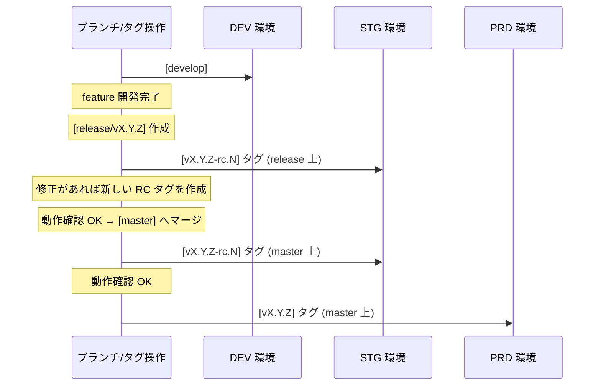
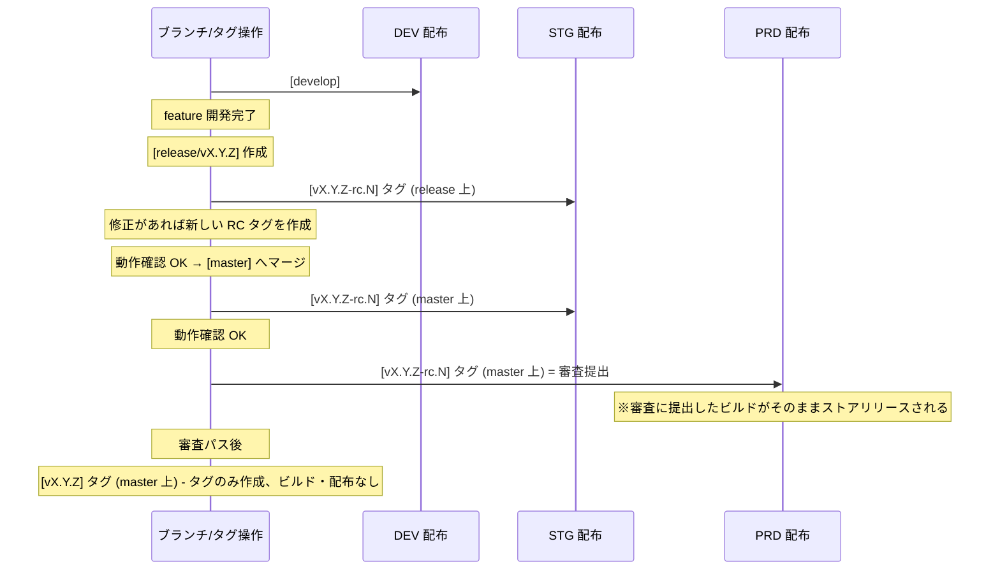

# デプロイ戦略

本ドキュメントは、各環境へのデプロイ戦略とタグ運用を定めたものです。

## 目次

1. [環境構成](#環境構成)
2. [ブランチ・タグと環境の対応](#ブランチタグと環境の対応)
3. [タグの種類と命名規則](#タグの種類と命名規則)
4. [RC タグの作成場所](#rc-タグの作成場所)
5. [アプリの配布（Distribute）](#アプリの配布distribute)
6. [デプロイフロー図](#デプロイフロー図)
7. [デプロイ・配布と動作確認の省略](#デプロイ配布と動作確認の省略)

---

## 環境構成

| 環境 | 略称 | 用途 |
|------|------|------|
| 開発環境 | DEV (Develop) | 開発中の機能確認用 |
| ステージング環境 | STG (Staging) | リリース候補の動作確認・審査用 |
| 本番環境 | PRD (Production) | エンドユーザー向け本番環境 |

---

## ブランチ・タグと環境の対応

| ブランチ / タグ | デプロイ先 | デプロイ方式 |
|-----------------|------------|--------------|
| `develop` ブランチ (HEAD) | DEV 環境 | 自動 / 半自動 / 手動 |
| `vX.Y.Z-rc.N` タグ | STG 環境 | 原則として手動 / 半自動 |
| `vX.Y.Z` タグ (master 上) | PRD 環境 | 原則として手動 / 半自動 |

### 詳細

#### DEV 環境 (develop ブランチ)

- `develop` ブランチの HEAD を DEV 環境にデプロイします
- デプロイは自動、半自動、または手動で実行可能です
- 開発中の最新機能を継続的に確認するために使用します

#### STG 環境 (vX.Y.Z-rc.N タグ)

- `vX.Y.Z-rc.N` タグを STG 環境にデプロイします
- リリース前の動作確認と、モバイルアプリの場合は審査提出に使用します
- RC タグは `release/*`、`hotfix/*`、`master` ブランチ上に作成される可能性があります

#### PRD 環境 (vX.Y.Z タグ)

- `vX.Y.Z` タグを PRD 環境にデプロイします
- **`vX.Y.Z` タグは `master` ブランチ上にのみ存在すること**
- 本番デプロイは原則として手動、または半自動（承認フロー付き）で実行します

---

## タグの種類と命名規則

### タグ命名規則

| タグ種別 | 形式 | 説明 |
|---------|------|-----|
| リリース候補タグ | `vX.Y.Z-rc.N` | STG 環境での動作確認・審査用 |
| 本番リリースタグ | `vX.Y.Z` | PRD 環境リリース用。**master ブランチ上にのみ存在** |

### Semantic Versioning

バージョン番号は Semantic Versioning (Sem-Ver) に従います。

```
vX.Y.Z
```

- **X (Major)**: 後方互換性のない変更
- **Y (Minor)**: 後方互換性のある機能追加
- **Z (Patch)**: 後方互換性のあるバグ修正

### 例

- リリース候補: `v1.2.0-rc.1`, `v1.2.0-rc.2`, `v1.2.0-rc.3`
- 本番リリース: `v1.2.0`, `v1.2.1`, `v2.0.0`

---

## RC タグの作成場所

`vX.Y.Z-rc.N` タグは、リリースプロセスにおいて**複数回作成**されます。RC タグの作成は STG 環境へのデプロイを意味します。

### RC タグを作成する場面

| 場面 | ブランチ | 説明 |
|------|----------|------|
| release ブランチ作成時 | `release/vX.Y.Z` | release ブランチを作成し、最初の RC タグを打って STG にデプロイ |
| release ブランチ更新時 | `release/vX.Y.Z` | PR 経由で fix がマージされるたびに RC タグを打って STG にデプロイ |
| master マージ時 | `master` | release ブランチを master にマージした後、master 上で RC タグを打って STG にデプロイ |
| master での動作確認 NG 時 | `hotfix/*` | master から hotfix/* ブランチを分岐し、修正が落ち着いた段階で RC タグを打って STG にデプロイ |
| hotfix マージ時 | `master` | hotfix を master に PR 経由でマージした後、master 上で RC タグを打って STG にデプロイ |

### 原則

- RC タグはリリース前の動作確認・審査提出を目的として作成します
- RC 番号は `1` から開始し、修正のたびにインクリメントします
- 例: `v1.2.0-rc.1` → `v1.2.0-rc.2` → `v1.2.0-rc.3`
- **本番リリース用の正式タグ `vX.Y.Z` を打つ前に、必ず master 上で RC タグを作成して動作確認を行います**

---

## アプリの配布（Distribute）

モバイルアプリの場合、デプロイではなく配布（distribute）を行います。

### iOS アプリ

| 環境 | 配布先 | 用途 |
|------|--------|------|
| DEV | Ad-hoc / 開発者向け | 開発中の確認 |
| STG | TestFlight (内部テスト) | RC の動作確認・審査 |
| PRD | App Store | エンドユーザー向け |

### Android アプリ

| 環境 | 配布先 | 用途 |
|------|--------|------|
| DEV | 内部配布 / Firebase App Distribution | 開発中の確認 |
| STG | Google Play 内部テストトラック | RC の動作確認・審査 |
| PRD | Google Play 製品版トラック | エンドユーザー向け |

### 審査対応

モバイルアプリの場合、ストア審査があるため、以下のフローに従います。

#### 審査対象となるビルド

- **審査に提出するのは `master` ブランチ上の `vX.Y.Z-rc.N` タグ（RC タグ）からビルドしたアプリです**
- **審査提出 = PRD 配布**です。審査に提出したビルドを公開するか否かのみコントロールでき、審査パス後に異なるビルドを公開することはできません
- 正式タグ `vX.Y.Z` のビルドを審査に提出することはありません

#### 審査フロー

1. `release` ブランチで動作確認を行い、問題がなければ `master` へマージ
2. `master` 上で RC タグ（`vX.Y.Z-rc.N`）を作成し、ビルドを作成して審査提出（= PRD 配布）
3. 審査リジェクトの場合、`master` ブランチから `hotfix/*` ブランチを分岐し、修正を行い、`master` にマージ後に新しい RC タグを作成して再提出
4. 審査パス後、審査にパスしたビルドがストアで公開される
5. **審査にパスした RC タグと同じコミットに対して** `vX.Y.Z` タグを作成（バージョン管理用。ビルド・配布は行わない）

> **重要**: 
> - **審査提出 = PRD 配布**です。審査にパスしたビルドがそのままストアで公開されます
> - 正式タグ `vX.Y.Z` は、審査にパスした RC タグと同一のコミットに対してバージョン管理のために作成しますが、このタグからビルド・配布は行いません

📘 **手順の詳細**: [ブランチ・デプロイ運用手順書 - 本番リリースを実施する](./branching-and-deployment-runbook.md#本番リリースを実施する)、[ブランチ・デプロイ運用手順書 - 審査リジェクト対応](./branching-and-deployment-runbook.md#審査リジェクト対応)

---

## デプロイフロー図

### Web アプリケーション



### モバイルアプリ



> **ポイント**: 
> - **審査提出 = PRD 配布**です。審査に提出したビルドを公開するか否かのみコントロールでき、審査パス後に異なるビルドを公開することはできません
> - ストア審査に提出するのは **RC タグ（`vX.Y.Z-rc.N`）のビルド**であり、審査にパスしたビルドがそのままストアリリースされます
> - 正式タグ `vX.Y.Z` はバージョン管理のために作成しますが、このタグからビルド・配布は行いません
> - **審査リジェクト時**: `master` ブランチから `hotfix/*` ブランチを分岐し、修正を行います。修正完了後に `hotfix/*` 上で RC タグを作成して動作確認し、`master` にマージ後に新しい RC タグを作成して再提出します。

---

## デプロイ・配布と動作確認の省略

新たにデプロイ・配布を行い STG で動作確認を実施しようとする際、直前にデプロイ・配布したタグとソースコード上の差分がなく完全一致する場合は、デプロイ・配布および動作確認を省略できます。

同じソースコードに対して同じ確認を行っても、同じ結果しか得られず時間の無駄となるためです。

---

## 関連ドキュメント

- [ブランチ戦略](./branching-strategy.md)
- [ブランチ・デプロイ運用手順書](./branching-and-deployment-runbook.md)
